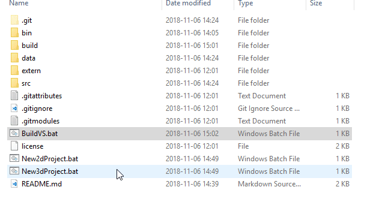
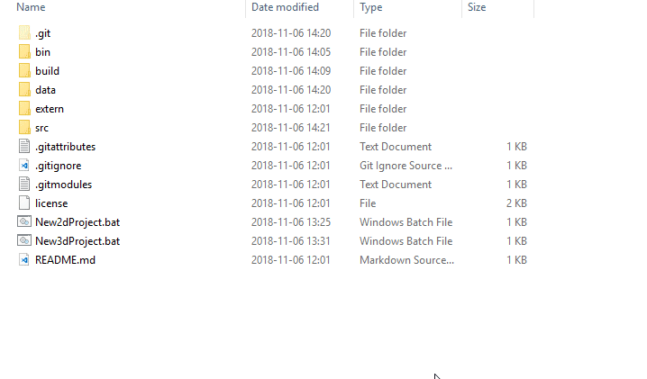

Graphics samples for [john-chapman.github.io](https://john-chapman.github.io/).

This project also serves as an example for using the [GfxSampleFramework](https://github.com/john-chapman/GfxSampleFramework) as a basis for your own demo/samples projects.

Currently only supporting Visual Studio/Windows.

### Cloning the Repo

1. Install [Git LFS](https://git-lfs.github.com/). 

2. Clone the repo. Don't forget to recursively clone the submodules ([GfxSampleFramework](https://github.com/john-chapman/GfxSampleFramework) and [ApplicationTools](https://github.com/john-chapman/ApplicationTools)):

```
git clone --recursive https://github.com/john-chapman/GfxSamples.git
```

### Building the Samples

1. Run `BuildVS.bat` and enter the target to generate a solution for:



_You can also run the `build/premake.lua` script directly (requires [premake5](https://premake.github.io/))._

2. Open `build/vs*/GfxSamples.sln`, build the projects.

### Creating a New Project

1. Run `New2dProject.bat` or `New3dProject.bat` and give your project a name:



This will set up a new empty project with skeleton `.h` and `.cpp` files and rebuild the VS2017 solution. Each project also has it's own data dir e.g. `data/MyProject/` where you should put the per-project shaders, textures, etc.

_Note that 3d projects derive from `frm::AppSample3d` which provides a default 3d camera and scene instance._

2. Open `build/vs*/GfxSamples.sln`. Take a look at the [tutorial project](src/Tutorial/Tutorial.cpp) for a quick start guide.

### Dependencies

Submodule dependencies:
- [ApplicationTools](https://github.com/john-chapman/ApplicationTools)
- [GfxSampleFramework](https://github.com/john-chapman/GfxSampleFramework)
